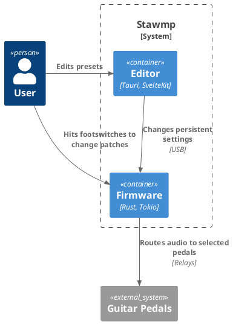

# Documentation

## Design

Containers:

```plantuml
@startuml

!include <C4/C4_Container>

Person(user, "User")
System_Boundary(stawmp, "Stawmp") {
    Container(editor, "Editor", "Tauri, SvelteKit")
    Container(firmware, "Firmware", "Rust, Tokio")
}
System_Ext(pedals, "Guitar Pedals")

Rel_R(user, firmware, "Hits footswitches to change patches")
Rel_R(user, editor, "Edits presets")
Rel(editor, firmware, "Changes persistent settings", "USB")
Rel(firmware, pedals, "Routes audio to selected pedals", "Relays")

@enduml
```
